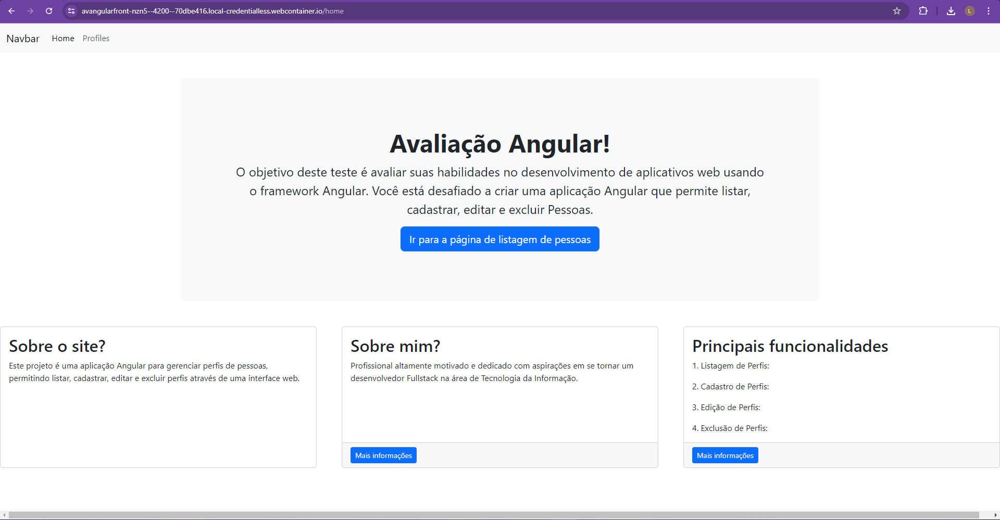
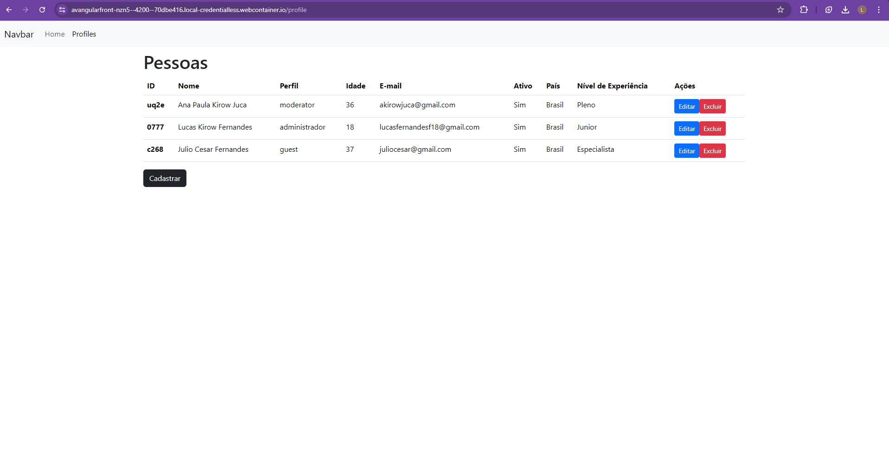
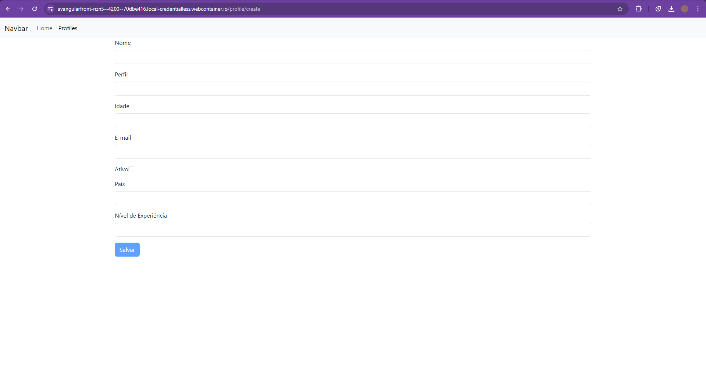

# Projeto Angular de Gerenciamento de Perfis

Este projeto é uma aplicação Angular para gerenciar perfis de pessoas, permitindo listar, cadastrar, editar e excluir perfis através de uma interface web.

## Tecnologias Utilizadas

- Angular 16
- TypeScript
- HTML/CSS
- Bootstrap (para estilos básicos)

## Funcionalidades Implementadas

1. **Listagem de Perfis:**
   - Exibe uma tabela com os perfis existentes, incluindo ID, Nome, Perfil, Idade, E-mail, Ativo, País, Nível de Experiência.
   - Botões de Ações para Editar e Excluir cada perfil.

2. **Cadastro de Perfis:**
   - Formulário para inserir um novo perfil com campos obrigatórios como Nome, Perfil, Idade e E-mail.

3. **Edição de Perfis:**
   - Formulário pré-preenchido com os dados do perfil selecionado para edição.

4. **Exclusão de Perfis:**
   - Confirmação antes de excluir um perfil.

## Estrutura do Projeto

- |-- src/
- |-- app/
- |-- pages/
- |-- home/
- |-- home.component.html
- |-- home.component.ts
- |-- home.component.css
- |-- profile/
- |-- profile-list/
- |-- profile-list.component.html
- |-- profile-list.component.ts
- |-- profile-list.component.css
- |-- profile-create-update/
- |-- profile-create-update.component.html
- |-- profile-create-update.component.ts
- |-- profile-create-update.component.css
- |-- services/
- |-- profile.service.ts
- |-- app-routing.module.ts
- |-- app.module.ts
- |-- angular.json
- |-- package.json
- |-- README.md
- |-- tsconfig.json
- |-- ...

## Como Executar o Projeto

Para executar este projeto localmente, siga os passos abaixo:

1. **Pré-requisitos:**
   - Node.js e npm instalados globalmente na sua máquina.

2. **Clonar o Repositório:**
   ```bash
   git clone https://github.com/seu-usuario/seu-projeto.git
   cd seu-projeto
   npm install
   ng serve

   Acessar a Aplicação:
   Abra seu navegador e acesse http://localhost:4200/
   ```

# Exemplo em imagens:
## Página home:


## Página de perfis:


## Página de cadastro e edição:
